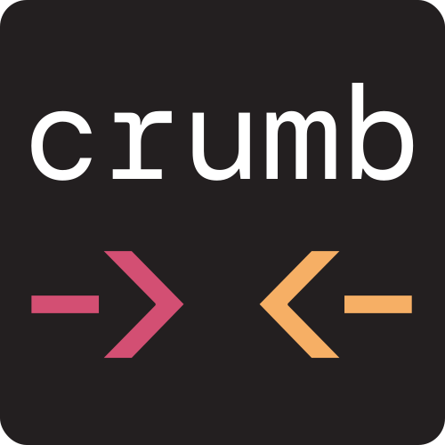

<p align=center></p>

# The Crumb Programming Language
Crumb is a high level, functional, interpreted, dynamically typed, general-purpose programming language, with a terse syntax, and a verbose standard library.

It features:
- Strictly __no side effects__* to help you write functional code
- The ability to __localize the effects of imported Crumb files__.
- __Dynamic typing__ and __garbage collection__.
- 0 keywords, __everything is a function__.
> *With the exception of IO

Click here to [Get Started](#getting-started).

---

```
table = (map (range 10) {_ y ->
  <- (map (range 10) {item x ->
    <- (multiply (add x 1) (add y 1))
  })
})
```
*From [`examples/mult-table.crumb`](./examples/mult-table.crumb)*

---


*From [`examples/game-of-life.crumb`](./examples/game-of-life.crumb)*

---

Find more examples under the [`examples`](./examples/) directory.

## Getting Started
### Install
**You do not need to clone this repo.** Instead, follow the instructions in [this template repo](https://github.com/liam-ilan/crumb-template).


### Basics
All function calls are done with s-expressions (think lisp). For example,
```
(print "hello world")
```

In this case, the function `print` is applied with the `string` `"hello world"` as an argument.

All data in crumb is one of 6 different types:
1. `string`
2. `integer`
3. `float`
4. `function` / `native function`
5. `list`
6. `void`

We can store this data in variables, for example,
```
a = 5
b = "hello"
```

We can combine data together to form lists,
```
magic_list = (list 123 "hello" 42.0)
```
Lists are always passed by value.

We can encapsulate code in functions using curly braces,
```
f = {
  (print "Funky!")
}

(f) // prints "Funky"
```

Functions can get arguments, denoted using the "->" symbol. For example,
```
add_two_things = {a b ->
  (print (add a b))
}

(add_two_things 3 5) // prints 8
```

They can also return values using the "<-" symbol,
```
geometric_mean = {a b ->
  <- (power (multiply a b) 0.5)
}

(print (geometric_mean 3 5) "\n") // prints 3.87...
```

Functions operate in a few important ways:
1. Function applications are *dynamically scoped*.
2. Functions *cannot create side effects*.
3. Like in JavaScript and Python, *functions can be passed into other functions as arguments*.

Most of the features you may expect in a programming language are implemented in the form of functions. For example, here is a Fizzbuzz program using the `add`, `loop`, `if`, `remainder`, `is`, and `print` functions,

```
(loop 100 {i -> 
  i = (add i 1)
  
  (if (is (remainder i 15) 0) {
      (print "fizzbuzz\n")
    } (is (remainder i 3) 0) {
      (print "fizz\n")
    } (is (remainder i 5) 0) {
      (print "buzz\n")
    } {(print i "\n")}
  )
})
```
*From [`examples/fizzbuzz.crumb`](./examples/fizzbuzz.crumb)*

You should now be ready to write your own Crumb programs! More info on how to build applications with events, files, code-splitting, and more, is found in the standard library documentation below.

## Standard Library
### IO
- `arguments`
  - A list command line arguments, like argv in C.

- `(print arg1 arg2 arg3 ...)`
  - Prints all arguments to stdout, returns nothing.

- `(input)`
  - Gets a line of input from stdin.

- `(rows)`
  - Returns the number of rows in the terminal.

- `(columns)`
  - Returns the number of columns in the terminal.

- `(read_file path)`
  - Returns the contents of the file designated by `path`, in a string. If the file cannot be read, returns void.
  - `path`: `string`

- `(write_file path contents)`
  - Writes the string `contents` into the file designated by `path`, returns nothing.
  - `path`: `string`
  - `contents`: `string`

- `(event)`
  - Returns the ANSI string corresponding with the current event. This may block for up to 0.1 seconds.

- `(use path1 path2 path3 ... fn)`
  - Crumb's code splitting method. Runs code in file paths, in order, on a new scope. Then uses said scope to apply `fn`.
  - `path1`, `path2`, `path3`, ...: `string`
  - `fn`: `function`
  
### Comparisons
- `(is a b)`
  - Checks if `a` and `b` are equal, returns `1` if so, else returns `0`. If `a` and `b` are lists, a deep comparison is made.

- `(less_than a b)`
  - Checks if `a` is less than `b`, returns `1` if so, else returns `0`.
  - `a`: `integer` or `float`
  - `b`: `integer` or `float`

- `(greater_than a b)`
  - Checks if `a` is greater than `b`, returns `1` if so, else returns `0`.
  - `a`: `integer` or `float`
  - `b`: `integer` or `float`

### Logical Operators
- `(not a)`
  - Returns `0` if `a` is `1`, and `1` if `a` is `0`.
  - `a`: `integer`, which is `1` or `0`

- `(and arg1 arg2 arg3 ...)`
  - Returns `1` if all arguments are `1`, else returns `0`
  - `arg1`, `arg2`, `arg3`, ...: `integer`, which is `1` or `0`

- `(or arg1 arg2 arg3 ...)`
  - Returns `1` if at least one argument is `1`, else returns `0`
  - `arg1`, `arg2`, `arg3`, ...: `integer`, which is `1` or `0`

### Arithmetic
- `(add arg1 arg2 arg3 ...)`
  - Returns `arg1` + `arg2` + `arg3` + ...
  - Requires a minimum of two args
  - `arg1`, `arg2`, `arg3`, ...: `integer` or `float`

- `(subtract arg1 arg2 arg3 ...)`
  - Returns `arg1` - `arg2` - `arg3` - ...
  - Requires a minimum of two args
  - `arg1`, `arg2`, `arg3`, ...: `integer` or `float`

- `(divide arg1 arg2 arg3 ...)`
  - Returns `arg1` / `arg2` / `arg3` / ...
  - Requires a minimum of two args
  - `arg1`, `arg2`, `arg3`, ...: `integer` or `float`

- `(multiply arg1 arg2 arg3 ...)`
  - Returns `arg1` * `arg2` * `arg3` * ...
  - Requires a minimum of two args
  - `arg1`, `arg2`, `arg3`, ...: `integer` or `float`

- `(remainder a b)`
  - Returns the remainder of `a` and `b`.
  - `a`: `integer` or `float`
  - `b`: `integer` or `float`
  
- `(power a b)`
  - Returns `a` to the power of `b`.
  - `a`: `integer` or `float`
  - `b`: `integer` or `float`

- `(random)`
  - Returns a random number from 0 to 1.

### Control
- `(loop count fn)`
  - Applies `fn`, `count` times. If `fn` returns, the loop breaks, and `loop` returns whatever `fn` returned, else repeats until loop is completed.
  - `count`: `integer`, which is greater than or equal to `0`
  - `fn`: `function`, which is in the form `{n -> ...}`, where n is the current loop index (starting at `0`).

- `(until stop fn initial_state)` or `(until stop fn)`
  - Applies `fn`, and repeats until `fn` returns `stop`. `until` returns whatever `fn` returned, before `stop`.
  - The return value of every past iteration is passed on to the next. The initial iteration uses `initial_state` if supplied, or returns `void` if not.
  - `fn`: `function`, which is in the form `{state n -> ...}`, where n is the current loop index (starting at `0`), and `state` is the current state.

- `(if condition1 fn1 condtion2 fn2 condtion3 fn3 ... fn_else)`
  - If `condition1` is `1`, applies `fn1`.
  - Else if `condition2` is `1`, applies `fn2`, else if ...
  - If no condtions were `1`, applies `fn_else`.
  - Return whatever the result of `fn1`, `fn2`, `fn3`, ..., or `fn_else` was.
  - `condition1`, `condition2`, `condition3`, ...: `integer`, which is `1` or `0`
  - `fn1`, `fn2`, `fn3`, ..., `fn_else`: `function`, which takes no arguments
  
- `(wait time)`
  - Blocks execution for `time` amount of seconds.
  - `time`: `integer` or `float`.

### Types
- `void`
  - A value of type `void`

- `(integer a)`
  - Returns `a` as an `integer`.
  - `a`: `string`, `float`, or `integer`.

- `(string a)`
  - Returns `a` as a `string`.
  - `a`: `string`, `float`, or `integer`.

- `(float a)`
  - Returns `a` as a `float`.
  - `a`: `string`, `float`, or `integer`.

- `(type a)`
  - Returns the type of `a` as a `string`.

### List and String
- `(list arg1 arg2 arg3 ...)`
  - Returns a `list`, with the arguments as it's contents.

- `(length x)`
  - Returns the length of `x`
  - `x`: `string` or `list`.

- `(join arg1 arg2 arg3 ...)`
  - Returns all args joined together.
  - All args must be of the same type.
  - `arg1`, `arg2`, `arg3`, ...: `string` or `list`.

- `(get x index1)` or `(get x index1 index2)`
  - Returns the item in `x` at `index1`. If x is a `string`, this is a single char.
  - If `index2` is supplied, returns a sub-array or substring from `index1` to `index2`, not including `index2`.
  - `x`: `string` or `list`.
  - `index1`: `int`.
  - `index2`: `int`.

- `(insert x item)` or `(insert x item index)`
  - Returns a `list` or `string`, in which `item` was inserted into `x` at `index`. Does not overwrite any data.
  - If `index` not supplied, `item` is assumed to be put at the end of `x`.
  - `x`: `string` or `list`.
  - `item`: `string` if `x` is `string`, else any
  - `index`: `int`.
  
- `(set x item index)`
  - Returns a `list` or `string`, in which the item located at `index` in `x`, was replaced by `item`.Overwrites data.
  - `x`: `string` or `list`.
  - `item`: `string` if `x` is `string`, else any
  - `index`: `int`.

- `(delete x index1)` or `(delete x index1 index2)`
  - Returns a `string` or `list`, where `index1` was removed from `x`.
  - If `index2` is supplied, all items from `index1` to `index2` are removed, not including `index2`.
  - `x`: `string` or `list`.
  - `index1`: `int`.
  - `index2`: `int`.

- `(map arr fn)`
  - Returns a list created by calling `fn` on every item of `arr`, and using the values returned by `fn` to populate the returned array.
  - `arr`: `list`
  - `fn`: `function`, which is in the form `{item i -> ...}`, where `item` is the current item, and `i` is the current index.

- `(reduce arr fn initial_acc)` or `(reduce arr fn)`
  - Returns a value, computed via running `fn` on every item in `arr`. With every iteration, the last return from `fn` is passed to the next application of `fn`. The final returned value from `fn` is the value returned from `reduce`.
  - `arr`: `list`.
  - `fn`: `function`, which is in the form `{acc item i -> ...}`, where `item` is the current item, `acc` is the accumulator (the result of `fn` from the last item), and `i` is the current index. `acc` is `initial_acc` if supplied, or `void` if not.

- `(range n)`
  - Returns a list with the integers from `0` to `n`, not including `n`.
  - `n`: `integer`, which is greater than or equal to 0.

- `(find x item)`
  - Returns the index of `item` in `x`. Returns `void` if not found.
  - `x`: `string` or `list`
  - `item`: `string` if `x` is `string`, else any

## Syntax
Crumb utilizes a notably terse syntax definition. The whole syntax can described in 6 lines of EBNF. Additionally, there are no reserved words, and only 7 reserved symbols.

### EBNF
```ebnf
program = start, statement, end;
statement = {return | assignment | value};
return = "<-", value;
assignment = identifier, "=", value;
value = application | function | int | float | string | identifier;
application = "(", {value}, ")";
function = "{", [{identifier}, "->"], statement, "}";
```


*Crumb syntax diagram, generated with [DrawGrammar](https://jacquev6.github.io/DrawGrammar/).*

### Tokens
```
"="
"("
")"
"{"
"}"
"->"
"<-"
identifier
int
float
string
start
end
```

### Specifics
Strings are characters surrounded by quotes, for example:
```
"hello world"
"this is\nsplit between new lines"
"\e[31mthis text is in red\e[0m"
```

Escape codes in Crumb are equivalent to their respective C escape codes. The list of supported escape codes is:
```
"\a"
"\b"
"\f"
"\n" 
"\r"
"\t"
"\v"
"\e"
"\\"
"\""
"\x4d" // for arbitrary ascii chars
```

Integers are groups of number characters, that may be preceded by `-` for example:
```
1234
-14
345
```

Floats are like integers, but have a decimal in them, for example:
```
13.45
-2.3
745.0
```

Identifiers are any collection of characters, that are not separated by whitespace, don't begin with quotes or numbers, and are not any reserved symbols, for example:
```
hello
x₂
symbol1
+
```

Comments start with "//", and end with the end of a line, for example:
```
// this is a program that prints hi
(print "hi") // this prints hi
```

## Development
When debugging the interpreter, it may be useful to compile with the `-g` flag.
```bash 
gcc src/*.c -g -Wall -lm -o crumb
```

This will allow Valgrind to provide extra information,
```bash
valgrind --leak-check=full -s ./crumb -d YOURCODE.crumb
```

To obtain debug information about how your code is interpreted (Tokens, AST, etc.), add the `-d` flag.
```bash
./crumb -d YOURCODE.crumb
```

## Credit
- Built by [Liam Ilan](https://www.liamilan.com/)